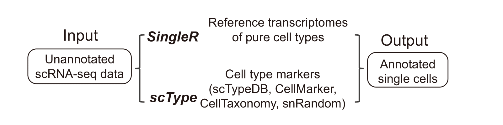
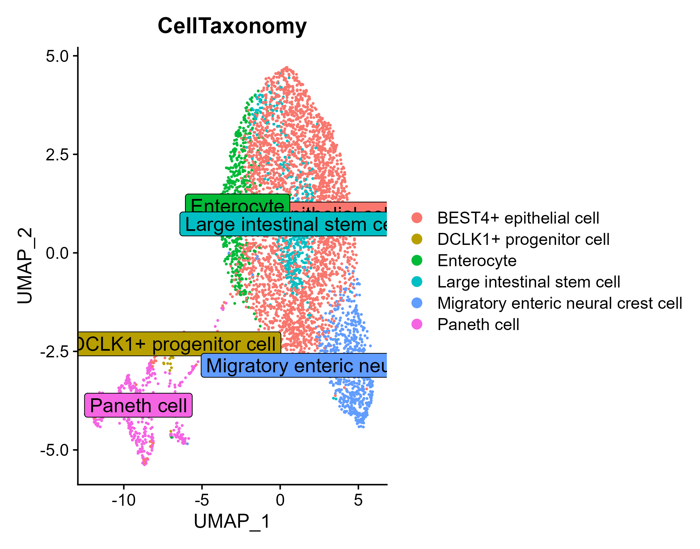

### scAnnotation: single-cell cell type annotation tool

### Workflow



### Usage

```{r}
# install packages
devtools::install_github('EternalVoice/scAnnotation')


library(Seurat)
libary(scAnnoation)

data("Cell_marker_All")
result <- scAnnotation(
    seurat_obj = seurat_obj,
    annot.method = 'marker',
    db.type = 'CellMarker',
    Tissue = Tissue,
    Species = 'Human',
    Cancer = TRUE
)
```

### Run examples

#### dataset: SingleR

SingleR_REF: https://drive.google.com/drive/folders/1E-al6H24sBmLjhuQFkui7SdwAe0fbSbM?usp=drive_link

```{r}
```{r}
library(Seurat)
libary(scAnnoation)

data('example_data')
result <- scAnnotation(
  seurat_obj = example_data, annot.method = 'dataset',
  dataset_ref = 'data/upload/SingleR_Reference/COAD.Qian2020.TME.rds'
)
example_data$celltype <- plyr::mapvalues(
  example_data$seurat_clusters,
  from = result$ClusterID,
  to = result$SingleRAnnot
)
DimPlot(
  object = example_data,
  group.by = 'celltype',
  label = T,
  label.size = 5,
  label.box = T
)
```

```


#### marker: CellMarker

```{r}
library(Seurat)
libary(scAnnoation)

data('example_data')
data("Cell_marker_All")
result <- scAnnotation(
  seurat_obj = example_data, annot.method = 'marker',
  db.type = 'CellMarker',
  Tissue = 'Intestine',
  Species = 'Human',
  Cancer = TRUE
)
result$seurat_clusters <- NULL
example_data <- AddMetaData(example_data, metadata = result)
DimPlot(
  object = example_data,
  group.by = 'CellMarkerAnnot',
  label = T,
  label.size = 5,
  label.box = T
)
```


#### marker: CellTaxonomy

```{r}
```{r}
library(Seurat)
libary(scAnnoation)

data("example_data")
data("Cell_Taxonomy")
result <- scAnnotation(
  seurat_obj = example_data, annot.method = 'marker',
  db.type = 'CellTaxonomy',
  Tissue = 'Intestine',
  Species = 'Human'
)
result$seurat_clusters <- NULL
example_data <- AddMetaData(example_data, metadata = result)
DimPlot(
  object = example_data,
  group.by = 'CellTaxonomy',
  label = T,
  label.size = 5,
  label.box = T
)
```



#### marker: snRandom

```{r}
library(Seurat)
libary(scAnnoation)

data("example_data")
data("snRandom_markers")
result <- scAnnotation(
  seurat_obj = example_data, annot.method = 'marker',
  db.type = 'snRandom'
)
result$seurat_clusters <- NULL
example_data <- AddMetaData(example_data, metadata = result)
DimPlot(
  object = example_data,
  group.by = 'snRandomAnnot',
  label = T,
  label.size = 5,
  label.box = T
)
```


